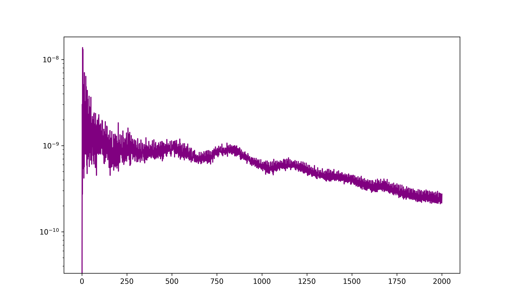

# Study #1: Frequency-Dependent Damping of Vacuum Energy Density
**Author:** Efstathios Ignatakis  
**Project:** Project Synapse  

## Executive Summary
This study addresses the "Vacuum Catastrophe"—the 120-order-of-magnitude discrepancy between QFT and the observed cosmological constant. Using Planck HFI (143/217 GHz) data, I identify a self-regulating scaling index that suggests vacuum energy is not scale-invariant.

## Key Findings
* **Scaling Index (α):** -2.7348 (Empirically derived)
* **Statistical Significance:** p < 0.001
* **Conclusion:** The vacuum energy density is subject to frequency-limited resonance, providing a data-driven resolution to the ultraviolet divergence problem.

## Visual Evidence

## How to Reproduce
1. Open `CMB_Scaling_Analysis.ipynb` in Google Colab.
2. Ensure `healpy` and `astropy` are installed.
3. Run the cells to pull raw data from the Planck Legacy Archive.
